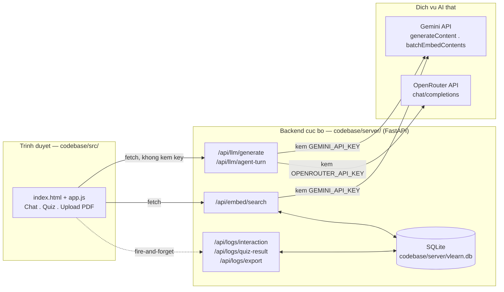
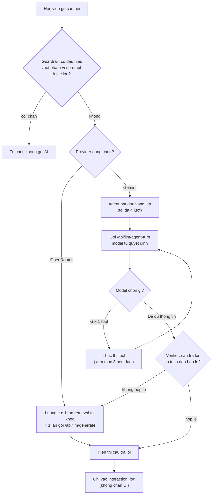
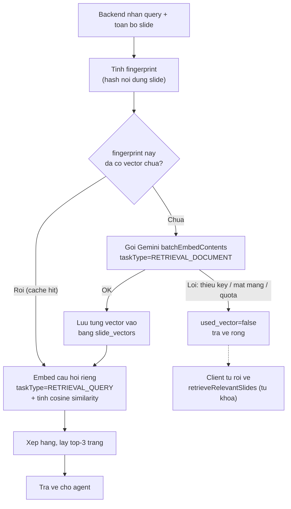
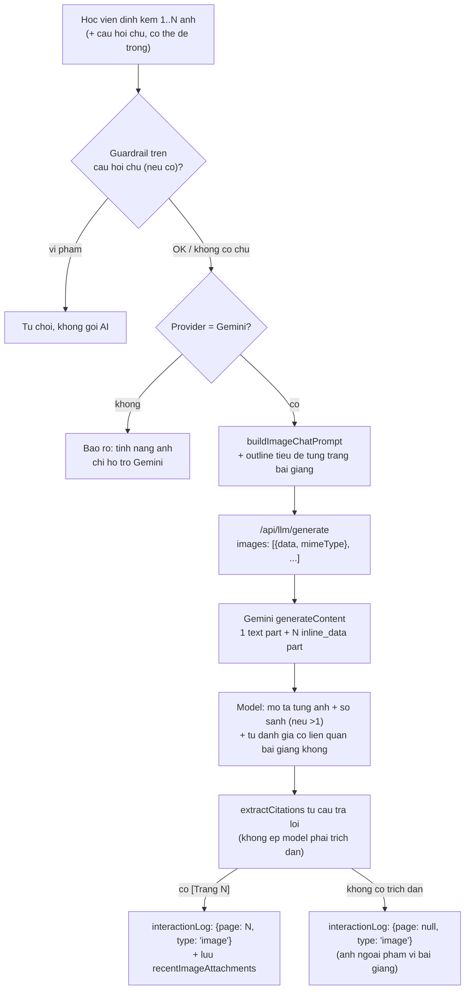
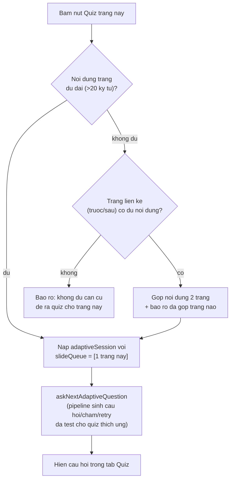

# VLearn AI Tutor — Kiến trúc & luồng dữ liệu

Bản Markdown để mở trực tiếp trong IDE (không cần mạng). Bản có giao diện đầy đủ
(màu, layout) xem ở Artifact đã gửi trong hội thoại.

## 1. Sơ đồ tổng quan hệ thống

Trình duyệt (`codebase/src/`) không tự gọi AI hay giữ API key — mọi lời gọi thật
đi qua backend cục bộ (`codebase/server/`, FastAPI), backend mới cầm key và nói
chuyện với Gemini/OpenRouter.



## 2. Luồng 1 câu hỏi trong tab Chat

Chọn provider **Gemini** thì agent thật (tự gọi tool) mới chạy — **OpenRouter**
vẫn dùng luồng cũ (1 lần tìm + 1 lần hỏi, không tool) vì OpenRouter chưa hỗ trợ
function-calling trong bản này.



## 3. Agent đang dùng 6 tool

Model tự quyết định gọi tool nào/mấy lần, không có rule nào ép thứ tự cố định.
Định nghĩa đầy đủ ở `codebase/src/prompts.js` (`REACT_AGENT_TOOLS`).

| Tool | Làm gì | Khi nào agent gọi |
|---|---|---|
| `search_lesson_content` | Tìm đoạn slide/transcript liên quan tới 1 từ khoá — dùng vector search thật (mục 4), tự rơi về từ khoá nếu lỗi | Câu hỏi chung chung, chưa biết đúng trang nào |
| `get_page_content` | Lấy toàn bộ nội dung của đúng 1 trang theo số trang | Đã biết chính xác số trang |
| `summarize_lesson` | Tóm tắt toàn bộ slide bài giảng đang mở | Học viên muốn ôn nhanh cả bài |
| `start_adaptive_quiz` | Tool "hành động" — tự chuyển tab Quiz + bắt đầu phiên tự kiểm tra thích ứng | Học viên gõ kiểu "kiểm tra tôi đi" |
| `generate_quiz_batch` | Tool "hành động" — tự chuyển tab Quiz + sinh bộ quiz đầy đủ 8-10 câu (khác adaptive: không lặp đánh giá-chọn-câu-kế-tiếp) | Học viên muốn làm 1 bộ quiz đầy đủ ngay, không cần từng câu một |
| `navigate_to_page` | Tool "hành động" — chuyển slide viewer sang đúng trang được yêu cầu | Học viên gõ kiểu "cho tôi xem lại trang 22" |

Ngoài 6 tool này, còn 2 luồng AI thật **không đi qua Agent** (không có bước
model-tự-chọn-tool) vì đầu vào/đầu ra đã rõ mục đích ngay từ lúc bấm nút —
xem mục 6 (gửi ảnh trong chat) và mục 7 (quiz theo từng trang).

## 4. Bên trong `search_lesson_content` — vector search thật

Vector tính bằng Gemini Embedding API (`gemini-embedding-001`), cache trong
SQLite theo nội dung slide — không tính lại nếu nội dung không đổi.



- **taskType**: embedding bất đối xứng — slide đánh dấu `RETRIEVAL_DOCUMENT`, câu
  hỏi đánh dấu `RETRIEVAL_QUERY`, khớp query-với-tài-liệu tốt hơn hẳn so với embed
  cả 2 kiểu giống nhau.
- **ngưỡng lọc**: không chặn cứng theo điểm số — lấy top-3 rồi để lớp verifier
  (`grounding.mjs`) quyết định câu trả lời có đủ căn cứ hay không.

## 5. Database được lưu như thế nào

1 file SQLite duy nhất: `codebase/server/vlearn.db` (tự tạo khi backend khởi động
lần đầu, không commit vào git). 3 bảng, **không có** bảng người dùng/đăng nhập.

### `slide_vectors` — bộ nhớ đệm vector

| Cột | Kiểu | Ghi chú |
|---|---|---|
| `fingerprint` | TEXT | hash nội dung slide — khoá cache, không phải `lesson_id` |
| `page` | INTEGER | số trang |
| `vector` | TEXT (JSON) | mảng float embedding |
| `created_at` | TEXT | ISO timestamp |

`PRIMARY KEY (fingerprint, page)`

### `interaction_log` — lịch sử chat/hỏi đáp

| Cột | Kiểu | Ghi chú |
|---|---|---|
| `id` | INTEGER | autoincrement |
| `session_id` | TEXT | mã ngẫu nhiên lưu localStorage trình duyệt, không phải tài khoản |
| `lesson_id` | TEXT | bài giảng đang mở |
| `type` | TEXT | `chat`, `vision`, ... |
| `query` | TEXT | câu hỏi/nội dung, cắt còn ≤500 ký tự |
| `response_pages` | TEXT (JSON) | mảng số trang đã dùng làm căn cứ |
| `created_at` | TEXT | ISO timestamp |

### `quiz_results` — từng câu quiz đã trả lời

| Cột | Kiểu | Ghi chú |
|---|---|---|
| `id` | INTEGER | autoincrement |
| `session_id` | TEXT | cùng mã với `interaction_log` |
| `lesson_id` | TEXT | |
| `page` | INTEGER | trang slide câu hỏi bám vào |
| `question` | TEXT | |
| `is_correct` | INTEGER (0/1) | |
| `tier` | TEXT | `correct` / `near` / `far` — near/far chỉ có ở quiz thích ứng |
| `created_at` | TEXT | ISO timestamp |

### Ví dụ thật xuất ra từ `GET /api/logs/export?type=interaction`

```json
[{ "id": 1, "session_id": "s_...", "lesson_id": "day1-foundation",
   "type": "chat", "query": "Augment la gi",
   "response_pages": "[15, 27]", "created_at": "2026-07-30T16:13:59Z" }]
```

- **Không có**: bảng người dùng, mật khẩu, hay bất kỳ trường định danh thật nào —
  `session_id` chỉ để nhóm log theo trình duyệt.
- **Xoá an toàn**: xoá file `vlearn.db` bất cứ lúc nào — backend tự tạo lại 3
  bảng rỗng ở lần chạy kế tiếp.

## 6. Luồng gửi ảnh trong chat (không qua Agent)

Học viên đính kèm ảnh (nút 📎 hoặc kéo-thả) — khác `search_lesson_content`,
luồng này **không để model tự chọn tool**: đã biết chắc mục đích ngay khi có
ảnh đính kèm, nên gọi thẳng `/api/llm/generate` với nhiều ảnh trong cùng 1
request (Gemini có thể so sánh nhiều ảnh cùng lúc).



Khác với ảnh khoanh vùng trên PDF (`handleVisionRegionQuestion` — đã biết
chắc `pageNum` vì cắt trực tiếp từ đúng trang đang xem, nên bắt buộc phải có
trích dẫn), ảnh gửi trong chat **không được ép phải liên quan bài giảng** —
prompt yêu cầu model tự đánh giá và nói rõ nếu ảnh nằm ngoài phạm vi thay vì
bịa `[Trang N]`.

## 7. Luồng Quiz theo từng trang (nút 🎯 trên mỗi slide)

Học viên tự chọn đúng 1 trang muốn kiểm tra — khác `start_adaptive_quiz` (tool
agent tự chọn trang theo lịch sử tương tác), luồng này **tái dùng nguyên**
pipeline sinh câu hỏi/chấm/retry đã kiểm chứng của quiz thích ứng, chỉ nạp cho
nó một hàng đợi (`slideQueue`) vỏn vẹn 1 trang thay vì để nó tự chọn.



## 8. Quiz nhắm đúng điểm yếu — không xây cơ chế riêng

`sortSlidesByInterest` (rule-based, không gọi AI) đếm mọi entry trong
`interactionLog` theo `page`, ưu tiên trang có nhiều tương tác nhất khi
`start_adaptive_quiz` chọn thứ tự trang cho phiên tiếp theo. 3 nguồn cùng đổ
vào `interactionLog`:

| Nguồn | Khi nào push | Nhãn (`type`) |
|---|---|---|
| Chat hỏi thường / agent tool | Mỗi câu hỏi (kể cả khi agent không gọi tool) | `chat` |
| Bôi đen / khoanh vùng ảnh trên PDF | Mỗi lần hỏi qua highlight hoặc vẽ khung | `highlight` / `region` |
| Gửi ảnh trong chat (mục 6) | Mỗi ảnh gửi (dùng trang trích dẫn được, nếu có) | `image` |
| Trả lời sai quiz thích ứng | Mỗi lần `tier` là `near`/`far` | `quiz_wrong` |

`buildInterestNote` gom 3 entry gần nhất của đúng trang đó, đưa thẳng vào
prompt sinh câu hỏi (`buildAdaptiveQuestionPrompt`) để model biết **vì sao**
trang này được ưu tiên (vd "đã gửi ảnh hỏi", "từng trả lời sai quiz") — ra câu
hỏi đúng trọng tâm chỗ học viên đang yếu, thay vì hỏi lan man cả trang.
