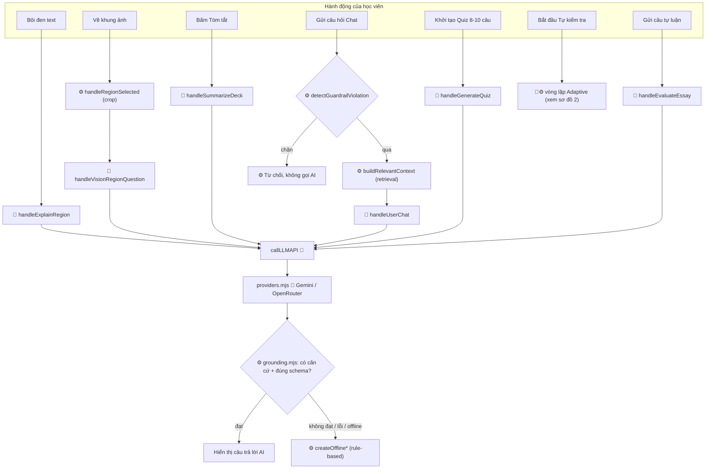
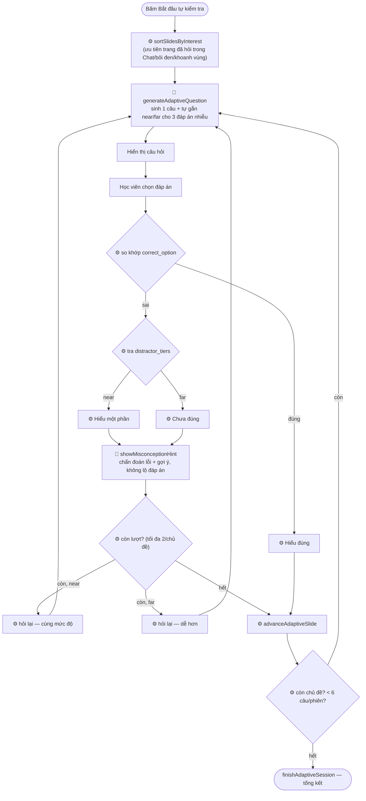
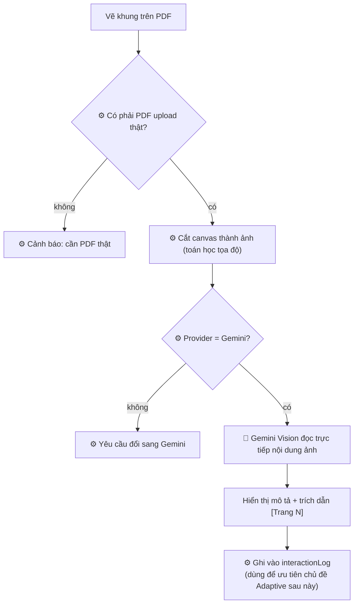

# Kiến trúc Agent — VLearn Practice Coach (`src/`)

Tài liệu này liệt kê toàn bộ function trong `src/` và đánh dấu cái nào là
**quyết định AI thật** (agent) so với **if-else/rule-based**, kèm workflow.

## Chú thích ký hiệu

| Ký hiệu | Ý nghĩa |
|---|---|
| 🤖 | Gọi AI thật (`callLLMAPI` → Gemini/OpenRouter) — kết quả không đoán trước được |
| ⚙️ | Rule-based / tất định — if-else, so khớp, đếm, regex, không có AI |
| 🖼️ | UI/DOM — render, wiring sự kiện, không phải một "quyết định" |
| 🔌 | Transport — xây/parse HTTP request, không tự quyết định nội dung |

---

## 1. `app.js` — bộ điều phối chính (agent controller)

| Function | Dòng | Loại | Ghi chú |
|---|---|---|---|
| `initApp` | 107 | 🖼️ | Khởi tạo app |
| `populateLessonSelector` | 115 | 🖼️ | Render dropdown bài học |
| `currentLesson` / `currentSlide` | 127/131 | ⚙️ | Getter state |
| `renderCurrentSlide` | 135 | 🖼️ | Render slide hiện tại |
| `cancelPDFRender` / `renderPDFPage` | 165/176 | 🖼️ | Vẽ trang PDF qua pdf.js |
| `updateQuickQuestion` | 228 | ⚙️ | Regex tìm từ "augment" để gợi ý câu hỏi nhanh |
| `setupEventListeners` | 238 | 🖼️ | Gắn toàn bộ event listener |
| `handleTextSelection` / `hideHighlightTooltip` | 377/405 | 🖼️ | Hiện/ẩn tooltip khi bôi đen |
| `navigateToPage` | 409 | 🖼️ | Nhảy tới trang khi bấm citation/"Xem lại Trang" |
| `setupUploadHandlers` / `isPDFFile` | 416/449 | 🖼️/⚙️ | Xử lý upload PDF |
| `extractPageText` | 453 | ⚙️ | Trích text-layer có sẵn trong PDF (**không phải OCR ảnh thật**) |
| `handlePDFUpload` | 471 | 🖼️ | Đọc toàn bộ PDF qua pdf.js |
| `renderUploadSuccess` / `renderDefaultUploadZone` / `removeUploadedLessons` / `removeUploadedLesson` / `showUploadError` | 563–621 | 🖼️ | UI khung upload |
| `switchTab` | 630 | 🖼️ | Chuyển tab Chat/Quiz |
| `escapeHTML` / `renderSafeMarkdown` | 638/647 | ⚙️ | Escape HTML + markdown-lite bằng regex |
| `appendMessage` | 658 | 🖼️ | Thêm bong bóng chat |
| `setAgentMode` | 682 | 🖼️ | Badge "Gemini live / offline / lỗi" |
| `activeProviderId` / `activeProvider` / `updateProviderReadiness` / `syncProviderControls` | 687–704 | ⚙️/🖼️ | Quản lý provider đang chọn |
| `delay` | 713 | ⚙️ | Chờ giữa các lần retry |
| **`callLLMAPI`** | 717 | 🔌 | **Cổng duy nhất gọi AI thật** — mọi quyết định 🤖 đều đi qua đây |
| `parseJSONObject` | 779 | ⚙️ | Parse JSON từ text AI trả về |
| `formatLessonContext` | 794 | ⚙️ | Ghép context gửi AI (không phải quyết định) |
| **`handleExplainRegion`** | 807 | 🤖 | Giải thích đoạn bôi đen |
| `handleRegionSelected` | 837 | ⚙️ | Cắt vùng ảnh đã khoanh thành canvas (toán học, không phải quyết định) |
| **`handleVisionRegionQuestion`** | 867 | 🤖 | Gửi ảnh cho Gemini Vision đọc hiểu |
| **`handleSummarizeDeck`** | 896 | 🤖 | Tóm tắt slide |
| **`handleUserChat`** | 920 | 🤖 | Hỏi đáp tự do (có guardrail + retrieval rule-based bên trong, xem bên dưới) |
| **`handleGenerateQuiz`** | 965 | 🤖 | Sinh quiz batch 8–10 câu |
| `renderQuizUI` | 1007 | 🖼️ | Render danh sách câu hỏi batch |
| `handleMCQAnswer` | 1087 | ⚙️ | Chấm trắc nghiệm batch (so chuỗi) |
| **`handleEvaluateEssay`** | 1119 | 🤖 | Chấm tự luận theo rubric trọng số |
| `renderEssayEvaluation` / `resetQuizView` | 1148/1160 | 🖼️ | UI |
| `eligibleAdaptiveSlides` | 1175 | ⚙️ | Lọc slide đủ text để hỏi |
| `sortSlidesByInterest` | 1180 | ⚙️ | **Đếm + sắp xếp** chủ đề theo lịch sử đã hỏi — rule-based |
| `buildInterestNote` | 1192 | ⚙️ | Format lại lịch sử hỏi thành text đưa vào prompt |
| `startAdaptiveSession` / `askNextAdaptiveQuestion` | 1199/1226 | ⚙️ | Điều phối vòng lặp (đếm câu, kiểm tra trần) |
| **`generateAdaptiveQuestion`** | 1258 | 🤖 | **Quyết định AI trung tâm**: sinh 1 câu + tự gắn nhãn near/far |
| `nextOfflineAdaptiveQuestion` | 1275 | ⚙️ | Câu hỏi dự phòng khi offline (rule-based, không adaptive thật) |
| `renderAdaptiveQuestion` | 1288 | 🖼️ | Render câu hỏi |
| `handleAdaptiveAnswer` | 1334 | ⚙️ | Chấm đúng/sai + tra tier + chọn nhánh tiếp theo — **toàn bộ if-else** |
| **`showMisconceptionHint`** | 1384 | 🤖 | Chẩn đoán ngộ nhận + gợi ý bám đúng lỗi sai |
| `showAdaptiveContinueActions` / `advanceAdaptiveSlide` / `finishAdaptiveSession` | 1410–1452 | 🖼️/⚙️ | UI + chuyển trạng thái phiên |

## 2. `grounding.mjs` — lớp an toàn/rule-based (0% AI)

Toàn bộ **~40 function** trong file này đều là ⚙️ rule-based — không có dòng nào gọi
`callLLMAPI`. Vai trò: retrieval (`retrieveRelevantSlides`, `buildRelevantContext`,
`scoreText`, `tokenize`...), verify câu trả lời AI có căn cứ hay không
(`validateGroundedResponse`, `validateHybridResponse`, `verifyCitationAndSnippet`,
`validateSingleQuestion`, `validateQuizData`), guardrail
(`detectGuardrailViolation` — regex, không phải AI router), và fallback khi
offline/AI trả lời không đạt (`createOfflineAnswer`, `createOfflineExplanation`,
`createOfflineSummary`, `createOfflineQuiz`, `evaluateEssayLocally`).

## 3. `prompts.js` — nội dung giao cho AI (không tự gọi AI)

| Function | Dùng cho quyết định |
|---|---|
| `buildExplainRegionPrompt` | `handleExplainRegion` |
| `buildSummarizeDeckPrompt` | `handleSummarizeDeck` |
| `buildQAGroundedPrompt` | `handleUserChat` |
| `buildQuizGeneratorPrompt` | `handleGenerateQuiz` (batch) |
| `buildAdaptiveQuestionPrompt` | `generateAdaptiveQuestion` (có yêu cầu gắn `distractor_tiers`) |
| `buildMisconceptionHintPrompt` | `showMisconceptionHint` |
| `buildVisionRegionPrompt` | `handleVisionRegionQuestion` |
| `buildEssayEvaluatorPrompt` | `handleEvaluateEssay` |
| `SYSTEM_ROUTER_PROMPT` | ⚠️ **Không được dùng ở đâu cả** — dead code, xem ghi chú cuối file |

## 4. `providers.mjs` — transport (không phải quyết định)

`getProviderConfig`, `buildProviderRequest`, `parseProviderResponse`,
`isRetryableProviderStatus` — build/parse HTTP request cho Gemini hoặc
OpenRouter; không tự quyết định nội dung.

---

## Workflow tổng quan

## Workflow chi tiết — Adaptive Quiz (lát cắt chính, đang được chấm)

## Workflow chi tiết — Vẽ khung hỏi ảnh (Vision)

---

## Ghi chú: `SYSTEM_ROUTER_PROMPT` là dead code

`implementation_plan.md` mô tả một "Security & Intent Router Agent" dùng AI để
phân loại ý định (EXPLAIN_REGION/SUMMARIZE_DECK/ASK_QUESTION/GENERATE_QUIZ/
OUT_OF_SCOPE). Prompt cho việc này (`SYSTEM_ROUTER_PROMPT`) đã được viết trong
`prompts.js` nhưng **không được import hay gọi ở bất kỳ đâu trong `app.js`**.
Trên thực tế, việc "route" hoàn toàn do người dùng bấm đúng nút/tab (rule-based),
và chặn câu ngoài phạm vi chỉ dựa vào regex (`detectGuardrailViolation`) — không
có AI nào phân loại intent. Cần sửa `implementation_plan.md`/`spec.md` cho khớp
thực tế, hoặc nối `SYSTEM_ROUTER_PROMPT` vào code nếu muốn giữ đúng lời khai.
